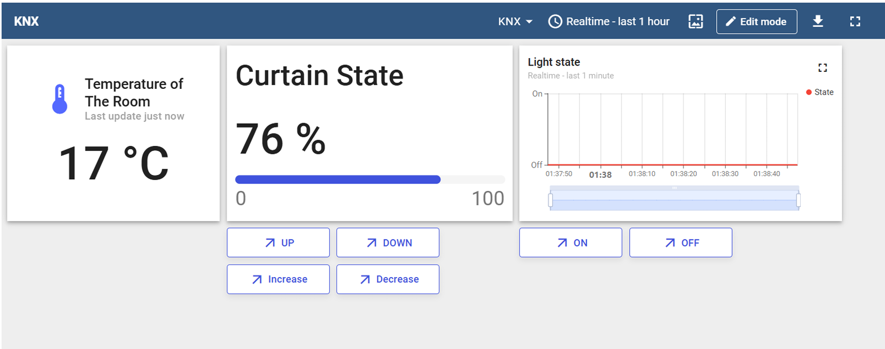
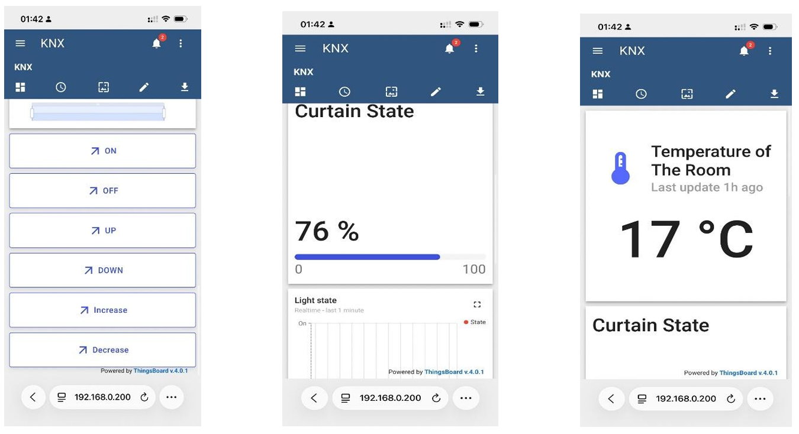

# KNX Smart Home with ThingsBoard & AI Assistant

A smart home IoT system integrating **KNX**, **ThingsBoard**, **MCP**, and a local **Ollama LLM** for real-time monitoring, device control, and Persian natural-language interaction.

The project implements a simulated KNX smart home, connects it to ThingsBoard through a locally deployed and customized ThingsBoard IoT Gateway, and extends the system with an AI assistant capable of monitoring and controlling the smart home through natural-language commands.

## Features

* KNX-based smart home simulation
* Smart light control and status monitoring
* Motorized curtain control and position monitoring
* Real-time room temperature monitoring
* ThingsBoard telemetry and RPC integration
* Responsive ThingsBoard dashboard for real-time monitoring and control
* Web and mobile access to smart-home telemetry and controls
* Bidirectional synchronization between ThingsBoard and KNX Virtual
* ThingsBoard IoT Gateway with KNX connector
* Custom modification of the ThingsBoard KNX uplink converter
* ETS6 project configuration included
* KNX Virtual simulation files included
* Local MCP server for exposing smart-home operations to AI
* Local Ollama LLM
* Persian natural-language interaction
* AI-based light control and home-status queries
---

## KNX Virtual & ETS Integration

A demonstration of the simulated KNX environment and its connection to ETS6:

https://github.com/user-attachments/assets/4822b599-3d9c-4b97-a791-788f7e054435

> **Note:** If the video does not play inline directly in your browser, you can access and download the raw recording [here](https://github.com/SMousavi7/smart-home-knx-thingsboard/blob/main/KNX/20260828_071514.mp4).

---

## Dashboard & Mobile Access

The smart home can be monitored and controlled in real time through a **ThingsBoard dashboard**.

The dashboard provides:

* Real-time room temperature monitoring
* Current curtain position
* Light state monitoring
* Light ON/OFF controls
* Curtain UP/DOWN controls
* Curtain position adjustment

### Web Dashboard

The ThingsBoard web dashboard provides a centralized interface for monitoring telemetry and controlling the KNX smart-home devices.



### Mobile Access

The same ThingsBoard dashboard is accessible from a mobile device on the local network, allowing the smart home to be monitored and controlled directly from a phone.

The mobile interface provides access to the same telemetry and RPC controls, including room temperature, curtain state, light state, and device-control commands.



Changes made through the web or mobile dashboard are sent through the ThingsBoard IoT Gateway to the KNX network and reflected in KNX Virtual.

Similarly, state changes originating from the KNX environment are reported back through the Gateway and displayed on the ThingsBoard dashboard.

```text
Web / Mobile Dashboard
          ↕
      ThingsBoard
          ↕
ThingsBoard IoT Gateway
          ↕
     KNX Connector
          ↕
      KNX Virtual
```

---

## Architecture

The system provides two main interaction interfaces:

1. **ThingsBoard Web/Mobile Dashboard** for direct monitoring and device control.
2. **AI Assistant** for Persian natural-language interaction.

```text
          ┌───────────────────┐
          │ ThingsBoard Web / │
          │ Mobile Dashboard  │
          └─────────┬─────────┘
                    │
                    ▼
          ┌───────────────────┐
          │    ThingsBoard    │◄──────────────┐
          │ Telemetry / RPC   │               │
          └─────────┬─────────┘               │
                    │                         │ REST / RPC
                    │ MQTT                    │
                    ▼                         │
          ┌───────────────────┐       ┌───────┴───────┐
          │ ThingsBoard IoT   │       │  MCP Server   │
          │ Gateway           │       │  TypeScript   │
          │                   │       └───────▲───────┘
          │ KNX Connector     │               │ MCP
          │ Custom Converter  │       ┌───────┴───────┐
          └─────────┬─────────┘       │    Ollama     │
                    │                 │   qwen3:4b    │
                    │ KNXnet/IP       └───────▲───────┘
                    ▼                         │
          ┌───────────────────┐       ┌───────┴───────┐
          │    KNX Virtual    │       │     User      │
          │                   │       │ Persian Input │
          │ • Light           │       └───────────────┘
          │ • Curtain         │
          │ • Temperature     │
          └───────────────────┘
```

---

## KNX Configuration

The KNX network is simulated using **KNX Virtual** and configured through **ETS6**.

The ETS6 and KNX Virtual files used for the implementation are included in this repository:

```text
KNX/
└── IoT Project.knxproj
```

These files can be used to reproduce the KNX configuration and simulated smart-home environment used in the project.

### KNX Group Addresses

The ThingsBoard IoT Gateway maps KNX Group Addresses to ThingsBoard telemetry and RPC operations.

### Telemetry

| Value            | Group Address | DPT     |
| ---------------- | ------------- | ------- |
| Room Temperature | `0/0/7`       | `9.001` |
| Light State      | `0/0/2`       | `1.001` |
| Curtain Position | `0/0/5`       | `5.001` |

### RPC Commands

| Method      | Group Address | DPT     |
| ----------- | ------------- | ------- |
| `setLight`  | `0/0/1`       | `1.001` |
| `moveBlind` | `0/0/3`       | `1.008` |
| `stopBlind` | `0/0/4`       | `1.007` |

The complete ThingsBoard KNX mapping is available in:

```text
gateway/config/myKnxGateway.json
```

---

## Custom ThingsBoard Gateway Modification

This project uses the official **ThingsBoard IoT Gateway**, but the KNX uplink converter was modified to support the behavior required by our implementation.

In the Windows Python virtual environment used during development, the original installed file was located at:

```text
.venv/Lib/site-packages/thingsboard_gateway/connectors/knx/knx_uplink_converter.py
```

The modified version used by this project is included in this repository:

```text
gateway/patches/knx_uplink_converter.py
```

When reproducing the project, the default `knx_uplink_converter.py` installed with the ThingsBoard IoT Gateway must be replaced with the modified version provided here.

> The exact `site-packages` path may differ depending on the operating system and Python installation.

---

## Project Structure

```text
.
├── ai-home-mcp/
│   ├── src/
│   │   ├── agent.ts
│   │   ├── index.ts
│   │   └── thingsboard.ts
│   ├── package.json
│   ├── tsconfig.json
│   └── yarn.lock
│
├── gateway/
│   ├── config/
│   │   ├── myKnxGateway.json
│   │   └── tb_gateway.example.json
│   │
│   └── patches/
│       └── knx_uplink_converter.py
│
├── KNX/
│   └── IoT Project.knxproj
│
├── docs/
│   ├── images/
│   │   ├── thingsboard-web-dashboard.png
│   │   └── thingsboard-mobile-dashboard.png
│   │
│   └── project-report.pdf
│
├── .gitignore
└── README.md
```

> The complete ThingsBoard IoT Gateway source code and its Python virtual environment are not included in this repository. The official Gateway is cloned separately, and the project-specific configurations and modified KNX converter provided here are then applied to it.

---

# Running the Project

The complete system consists of several components. They should be configured and started in the following order:

```text
1. Load the ETS6 Project
2. Set Up KNX Virtual
3. ThingsBoard
4. ThingsBoard IoT Gateway
5. KNX Connector
6. ThingsBoard Dashboard
7. Ollama
8. MCP Server / AI Agent
```
---

## 1. Load the ETS6 Project

Open **ETS6**.

The ETS6 project used for this implementation is provided under:

```text
KNX/IoT Project.knxproj
```

Import/open the provided project and connect ETS6 to KNX Virtual through its KNXnet/IP interface.

The main KNX Group Addresses are:

```text
0/0/1   Light command
0/0/2   Light state

0/0/3   Curtain movement
0/0/4   Curtain stop
0/0/5   Curtain position

0/0/7   Room temperature
```
---

## 2. Set Up KNX Virtual

Install and launch **KNX Virtual**.

Load the provided files to reproduce the simulated environment. To program and commission each device in the simulation, follow these steps:

1. **Configure Interface & Initiate Download:**
   - In **ETS6**, ensure **KNX Virtual** is selected as the active bus communication interface.
   - Open the **Buildings** panel and locate the target device.
   - Right-click the device, select **Download**, and choose **Download All**.

2. **Trigger Programming in KNX Virtual:**
   - In **KNX Virtual**, navigate to **Installation > Configuration**.
   - Click the corresponding device (matching the individual address / ID selected in ETS6) to put it into programming mode.
   - The download progress will start in ETS6. Wait for the operation to complete.

Repeat this process for all simulated devices in the project to finish commissioning.

The simulated smart home contains:

* Light
* Motorized curtain
* Temperature sensor

In ETS6 open the **ETS Group Monitor** to verify communication before proceeding.

You should be able to control the simulated devices and observe their state changes from ETS.

---

## 3. Start ThingsBoard

Start a **ThingsBoard Community Edition** instance.

Create a Gateway device in ThingsBoard and obtain its access token.

The project configuration used during development expects the ThingsBoard MQTT service at:

```text
Host: 127.0.0.1
Port: 1883
```

If ThingsBoard is running on another machine or container, update the Gateway configuration accordingly.

---

# ThingsBoard IoT Gateway Setup

The ThingsBoard IoT Gateway used in this project was run locally from the official ThingsBoard Gateway source inside an isolated **Python virtual environment**.

The full Gateway source and `.venv` are not stored in this repository.

## 4. Clone the ThingsBoard IoT Gateway

Clone the official ThingsBoard IoT Gateway repository:

```bash
git clone https://github.com/thingsboard/thingsboard-gateway.git
cd thingsboard-gateway
```

---

## 5. Create a Python Virtual Environment

### Windows

```powershell
python -m venv .venv
.venv\Scripts\activate
```

### Linux/macOS

```bash
python3 -m venv .venv
source .venv/bin/activate
```

---

## 6. Install the ThingsBoard IoT Gateway

With the virtual environment activated:

```bash
pip install -e .
```

The Gateway and its Python dependencies will be installed inside the virtual environment.

---

## 7. Apply the Custom KNX Uplink Converter

**This step is required to reproduce the implementation used in this project.**

The modified converter is provided at:

```text
gateway/patches/knx_uplink_converter.py
```

After installing the ThingsBoard IoT Gateway, locate its installed KNX converter:

```text
thingsboard_gateway/connectors/knx/knx_uplink_converter.py
```

In the Windows environment used during development, it was located at:

```text
.venv/Lib/site-packages/thingsboard_gateway/connectors/knx/knx_uplink_converter.py
```

Replace that file with:

```text
gateway/patches/knx_uplink_converter.py
```

Conceptually:

```text
Repository
gateway/patches/knx_uplink_converter.py
                │
                │ replace
                ▼
Python venv
.venv/Lib/site-packages/
└── thingsboard_gateway/
    └── connectors/
        └── knx/
            └── knx_uplink_converter.py
```

The exact `site-packages` location may vary depending on the operating system and Python installation.

---

## 8. Add the Gateway Configuration

The project-specific Gateway configuration is available under:

```text
gateway/config/
```

Copy:

```text
gateway/config/myKnxGateway.json
```

to the configuration directory used by your ThingsBoard IoT Gateway.

Then create the local Gateway configuration based on:

```text
gateway/config/tb_gateway.example.json
```

and provide the access token of the Gateway device created in ThingsBoard.

The resulting local installation should contain the equivalent of:

```text
thingsboard-gateway/
├── .venv/
│
├── config/
│   ├── tb_gateway.json
│   └── myKnxGateway.json
│
└── ...
```

Do not commit the local `.venv` or credential-containing `tb_gateway.json` to GitHub.

---

## 9. Configure the KNX Connection

Open:

```text
myKnxGateway.json
```

and verify the KNXnet/IP connection settings.

The project uses the standard KNXnet/IP port:

```text
3671
```

If KNX Virtual and the Gateway are running in different environments, update the configured IP address so the Gateway can reach the KNX Virtual interface.

---

## 10. Start the ThingsBoard IoT Gateway

Activate the virtual environment.

### Windows

```powershell
.venv\Scripts\activate
```

### Linux/macOS

```bash
source .venv/bin/activate
```

Then start the installed ThingsBoard IoT Gateway.

Verify from the Gateway logs that both the ThingsBoard connection and KNX connector have successfully started.

Once connected, KNX telemetry should begin appearing in ThingsBoard.

---

## 11. Verify Telemetry

Open the KNX smart-home device in ThingsBoard.

The following telemetry values should become available:

```text
roomTemperature
lightState
blindPosition
```

Changing the corresponding values in KNX Virtual should update ThingsBoard.

The telemetry path is:

```text
KNX Virtual
     ↓
KNXnet/IP
     ↓
KNX Connector
     ↓
Custom Uplink Converter
     ↓
ThingsBoard IoT Gateway
     ↓
ThingsBoard Telemetry
     ↓
Web / Mobile Dashboard
```

---

## 12. Verify Device Control

The dashboard provides controls for the simulated KNX devices.

For example, sending:

```text
setLight → true
```

should turn the simulated light on.

The control path is:

```text
Web / Mobile Dashboard
          ↓
      ThingsBoard
          ↓
ThingsBoard RPC
          ↓
ThingsBoard IoT Gateway
          ↓
     KNX Connector
          ↓
       KNXnet/IP
          ↓
      KNX Virtual
          ↓
         Light
```

This verifies bidirectional communication between ThingsBoard and the simulated KNX smart home.

---

# AI Assistant

The project also extends the smart-home system with a local AI assistant.

The AI component is located under:

```text
ai-home-mcp/
```

It consists of:

* TypeScript MCP server
* ThingsBoard REST/RPC integration
* Ollama-based AI agent
* MCP tools for monitoring and controlling the smart home

The AI layer does not replace the ThingsBoard dashboard. It provides an additional natural-language interface over the same smart-home infrastructure.

---

## MCP Tools

### `get_home_status`

Reads the latest ThingsBoard telemetry, including:

```text
roomTemperature
lightState
blindPosition
```

This allows the user to ask questions such as:

```text
دمای خونه الان چنده؟
```

or:

```text
چراغ روشنه؟
```

### `set_light`

Sends a ThingsBoard RPC command to control the KNX light.

This allows commands such as:

```text
چراغ رو روشن کن
```

and:

```text
چراغ رو خاموش کن
```

---

# AI Assistant Setup

## 13. Install Ollama

Install and start **Ollama**.

Pull the model used by the project:

```bash
ollama pull qwen3:4b
```

Verify that the model is available:

```bash
ollama run qwen3:4b
```

---

## 14. Install AI Dependencies

Navigate to:

```bash
cd ai-home-mcp
```

Install the project dependencies:

```bash
yarn install
```

---

## 15. Configure ThingsBoard Access

The MCP component requires access to the ThingsBoard REST API and the smart-home device.

Provide the following values in your local runtime environment:

```text
THINGSBOARD_URL
THINGSBOARD_USERNAME
THINGSBOARD_PASSWORD
THINGSBOARD_DEVICE_ID
```

Example:

```text
THINGSBOARD_URL=http://localhost:8080
THINGSBOARD_USERNAME=<your ThingsBoard username>
THINGSBOARD_PASSWORD=<your ThingsBoard password>
THINGSBOARD_DEVICE_ID=<your smart-home device ID>
```

Do not commit real ThingsBoard credentials or access tokens to GitHub.

---

## 16. Run the MCP Server

To run the MCP server directly:

```bash
yarn dev
```

The MCP server exposes the implemented smart-home tools to compatible MCP clients.

---

## 17. Run the AI Agent

Start the interactive AI assistant:

```bash
yarn agent
```

The agent uses the local:

```text
qwen3:4b
```

model through Ollama and connects it to the MCP smart-home tools.

Example Persian interactions:

```text
دمای خونه الان چنده؟
```

```text
چراغ روشنه؟
```

```text
چراغ رو روشن کن
```

```text
چراغ رو خاموش کن
```

### Telemetry Query Flow

```text
User
  ↓
Ollama
  ↓
MCP get_home_status
  ↓
ThingsBoard REST API
  ↓
Latest Telemetry
  ↓
Ollama
  ↓
Persian Response
```

### AI Device Control Flow

```text
User
  ↓
Ollama
  ↓
MCP set_light
  ↓
ThingsBoard RPC
  ↓
ThingsBoard IoT Gateway
  ↓
KNX Connector
  ↓
KNX Virtual
  ↓
Light
```

---

## Technologies

* KNX
* KNX Virtual
* ETS6
* ThingsBoard Community Edition
* ThingsBoard IoT Gateway
* MQTT
* Python
* TypeScript
* Model Context Protocol (MCP)
* Ollama
* Qwen3 4B

---

## Security

Generated environments, dependencies, logs, and files containing credentials should not be committed.

The repository should exclude:

```text
.env
.venv/
node_modules/
logs/
tb_gateway.json
```

Never commit ThingsBoard access tokens, usernames, or passwords to a public repository.

A suitable `.gitignore` includes:

```gitignore
# Environment variables
.env
.env.*

# Python
.venv/
venv/
__pycache__/
*.pyc

# Node
node_modules/

# Logs
logs/
*.log

# Local ThingsBoard configuration containing credentials
gateway/config/tb_gateway.json

# OS
.DS_Store
Thumbs.db
```

---

## Project Report

The complete coursework report, including the implemented architecture, KNX/ETS configuration, ThingsBoard dashboards, AI integration, implementation details, and results, is available at:

```text
docs/project-report.pdf
```

---

## Authors

This project was developed collaboratively by:

* **[@SMousavi7](https://github.com/SMousavi7)**
* **[@MilladAnsari](https://github.com/MilladAnsari)**

Developed as part of an **Internet of Things** course project focusing on smart building automation, KNX, IoT platforms, MCP, and AIoT.
